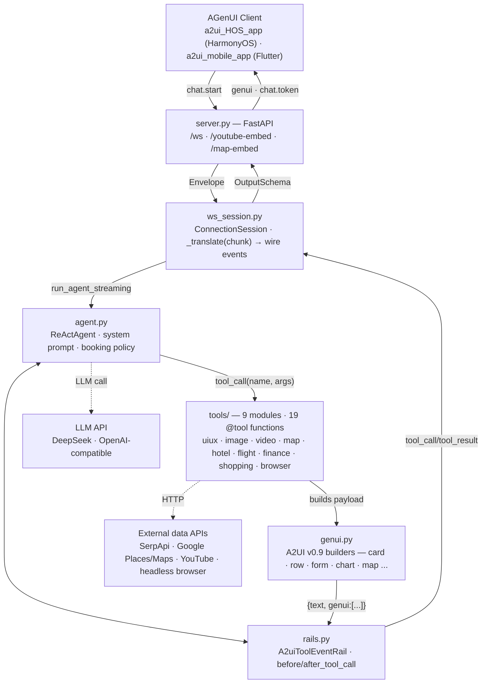
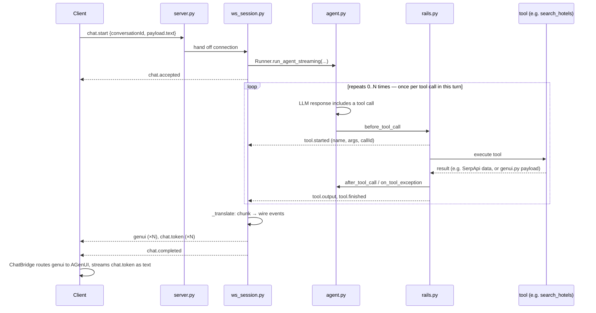

# A2UI Agent Blueprint

One openJiuwen `ReActAgent`, exposed over one WebSocket endpoint, that turns
a chat message into streamed A2UI (GenUI) surfaces -- cards, maps, forms,
charts -- rendered natively by the HarmonyOS / Flutter client on the other
end. No REST layer, no database: one socket, one agent, nineteen tools.

Full interactive version (with the diagrams below rendered as inline SVG):
<https://claude.ai/code/artifact/7ecd2dc0-8605-4d1c-919b-9c6cf9dc6872>

## 1. System architecture

The request path runs down the left spine, the streamed response back up
the right -- `rails.py` is what makes that response path exist per tool
call rather than only at the very end. `genui.py` has no network access of
its own; every tool that renders something calls into it to shape the
JSON, then hands that back up through the same result path.



## 2. Request lifecycle

One `chat.start` can trigger zero, one, or several tool calls before the
agent has a final answer. Steps 3-6 are the ReAct loop, not a fixed
pipeline -- a query that needs no data ("hello") skips the loop entirely;
one that needs several (`geocode_place` for each stop on a trip) runs it
several times before the agent has enough to answer.



## 3. Tool inventory

Every module lives under `tools/` and is assembled into one `ALL_TOOLS`
tuple in `uiux_tools.py` for `agent.py` to register. A tool either renders
through `genui.py`, calls an external service, or both.

| Module | `@tool` functions | External service | Notes |
|---|---|---|---|
| `uiux_tools.py` | `get_current_time` · `show_card` · `show_info_list` · `ask_preferences_form` | — | General-purpose; assembles `ALL_TOOLS` for every other module |
| `image_tools.py` | `search_images` · `fetch_page_image` | SerpApi | Google Images Light engine; og:image scrape fallback |
| `video_tools.py` | `search_youtube_videos` · `fetch_video_source` · `show_video_clips` | YouTube | Direct-video HTML5 source also supported, not just YouTube |
| `map_tools.py` | `geocode_place` · `show_map` · `render_map_embed_html` | Google Places · Maps | Serves `/map-embed` itself; shared aiohttp session for connection pooling |
| `hotel_tools.py` | `search_hotels` · `show_hotel_results` | SerpApi | Google Hotels engine; falls back to `free_search` when empty |
| `flight_tools.py` | `search_flights` · `show_flight_results` | SerpApi | Google Flights engine; same booking-policy fallback as hotels |
| `finance_tools.py` | `search_finance` · `show_finance_results` | SerpApi | Renders price history as a native `genui.chart()` |
| `shopping_tools.py` | `search_products` · `show_shopping_results` | SerpApi | Google Shopping engine |
| `browser_tools.py` | `browser_inspect_page` | Headless browser | Read-only Playwright fallback for JS-rendered pages |

## 4. Wire protocol

Every message on the socket is one `Envelope` -- no framing beyond that,
no separate control channel.

```json
{
  "id": "a1b2c3…",
  "type": "chat.start",
  "conversationId": "conv-9",
  "timestamp": 1735689600000,
  "payload": { }
}
```

**Client → server** (2 message types): `chat.start`, `chat.cancel`

**Server → client** (7 message types, streamed): `chat.accepted`,
`tool.started`, `tool.output`, `tool.finished`, `genui`, `chat.token`,
`chat.completed`
