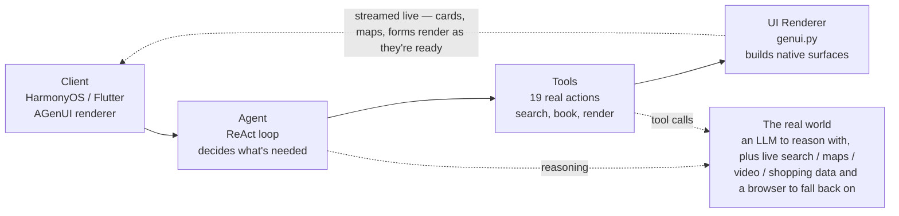
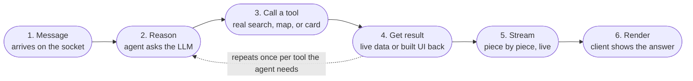

# A2UI System Overview

One agent, one socket, real answers. A message comes in over WebSocket; an
LLM-driven agent decides what's needed, reaches out to real services for
real data, and streams the result back as live, native UI -- not a wall of
text.

Full interactive version (with the diagrams below rendered as inline SVG):
<https://claude.ai/code/artifact/f4ecfc78-0ddd-468c-bf38-c2f06137d8a1>

## 1. Four stages, one loop

Everything the extension does happens between a client opening a socket
and that same socket receiving back native UI, not a chat transcript.
Nothing is faked or remembered from training data -- every card, map pin,
and price the agent shows came back from a real call made a few hundred
milliseconds earlier.

## 2. From message to rendered answer

Not every message needs all six steps -- "hello" skips straight to step 6.
A trip-planning request runs the middle loop several times, once per
place, flight, or hotel involved. The loop over steps 2-4 is the whole
point of a ReAct agent over a plain chat completion: the model can ask for
more real information before committing to an answer, instead of guessing
once and hoping.

## 3. The four guarantees

| | | |
|---|---|---|
| **Input** | One socket | No REST endpoints, no polling -- a single WebSocket carries every message in both directions. |
| **Reasoning** | One agent | A single ReAct agent handles every request type -- no routing between separate bots per domain. |
| **Action** | Real services only | Every tool hits a real API or a real page -- nothing in the response is invented by the model. |
| **Output** | Native, not text | Results become native cards, maps, and forms on the client, not a block of markdown. |

---

See [`ARCHITECTURE_BLUEPRINT.md`](./ARCHITECTURE_BLUEPRINT.md) for the
wire-level detail this overview leaves out.
